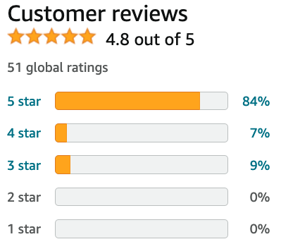
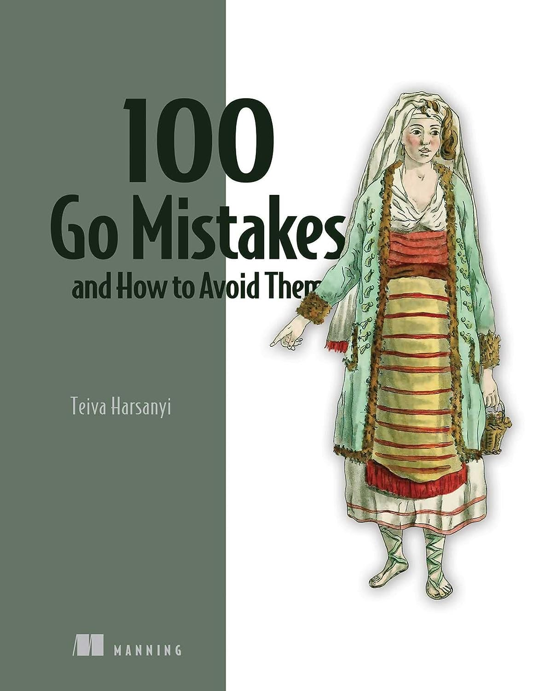

# 100 Go Mistakes and How to Avoid Them

Community space of 📖 _100 Go Mistakes and How to Avoid Them_, published by Manning in 2022.

## Description

If you're a Go developer looking to improve your skills, this book is for you. With a focus on practical examples, _100 Go Mistakes and How to Avoid Them_ covers a wide range of topics from concurrency and error handling to testing and code organization. You'll learn to write more idiomatic, efficient, and maintainable code and become a proficient Go developer.

Read a summary of the 100 mistakes [here](https://100go.co).

## Quotes and Ratings

!!! quote "Krystian (Goodreads user)"

    This is an **exceptional book**. Usually, if a book contains either high-quality explanations or is written succinctly, I consider myself lucky to have found it. This one combines these two characteristics, which is **super rare**. It's another Go book for me and I still had quite a lot of "a-ha!" moments while reading it, and all of that without the unnecessary fluff, just straight to the point.

!!! quote "Akash Chetty"

    The book is completely **exceptional**, especially the examples carved out for each topic are really great. There is one topic that I struggled to understand is Concurrency but the way it is explained in this book is truly an art of genius.

!!! quote "Neeraj Shah"

    This should be the **required reading** for all Golang developers before they touch code in **Production**... It's the Golang equivalent of the legendary 'Effective Java' by Joshua Bloch.

!!! quote "Anupam Sengupta"

    Not having this will be the **101st mistake** a Go programmer could make.

<figure markdown>
  
  {width="300"}
  {width="300"}
  <figcaption>Manning, Goodreads, and Amazon reviews: 4.7/5 avg rating</figcaption>
</figure>

## Where to Buy?

<figure markdown>
  {width="200"}
  {width="200"}
  <figcaption>English and Japanese front covers</figcaption>
</figure>

* _100 Go Mistakes and How to Avoid Them_ (🇬🇧 edition: paper, digital, or audiobook)
	* [Manning](https://www.manning.com/books/100-go-mistakes-and-how-to-avoid-them) (make sure to use my personal discount code for -35%: `au35har`)
	* [O’Reilly](https://www.oreilly.com/library/view/100-go-mistakes/9781617299599/)
	* Amazon: [.com](https://www.amazon.com/dp/1617299596), [.co.uk](https://www.amazon.co.uk/dp/B0BBSNJR6B), [.de](https://www.amazon.de/dp/B0BBHQD8BQ), [.fr](https://www.amazon.fr/100-Mistakes-How-Avoid-Them/dp/1617299596), [.in](https://www.amazon.in/dp/B0BBHQD8BQ), [.co.jp](https://www.amazon.co.jp/dp/B0BBHQD8BQ), [.es](https://www.amazon.es/dp/B0BBHQD8BQ), [.it](https://www.amazon.it/dp/B0BBHQD8BQ), [.com.br](https://www.amazon.com.br/dp/B0BBHQD8BQ)

* _Go言語100Tips 開発者にありがちな間違いへの対処法_ (🇯🇵 edition: paper or digital)
	* Amazon: [.co.jp](https://www.amazon.co.jp/exec/obidos/ASIN/4295017531/)

## About the Author

[Teiva Harsanyi](http://teivah.io) is a senior software engineer at Google. He has worked in various domains, including insurance, transportation, and safety-critical industries like air traffic management. He is passionate about Go and how to design and implement reliable systems.
